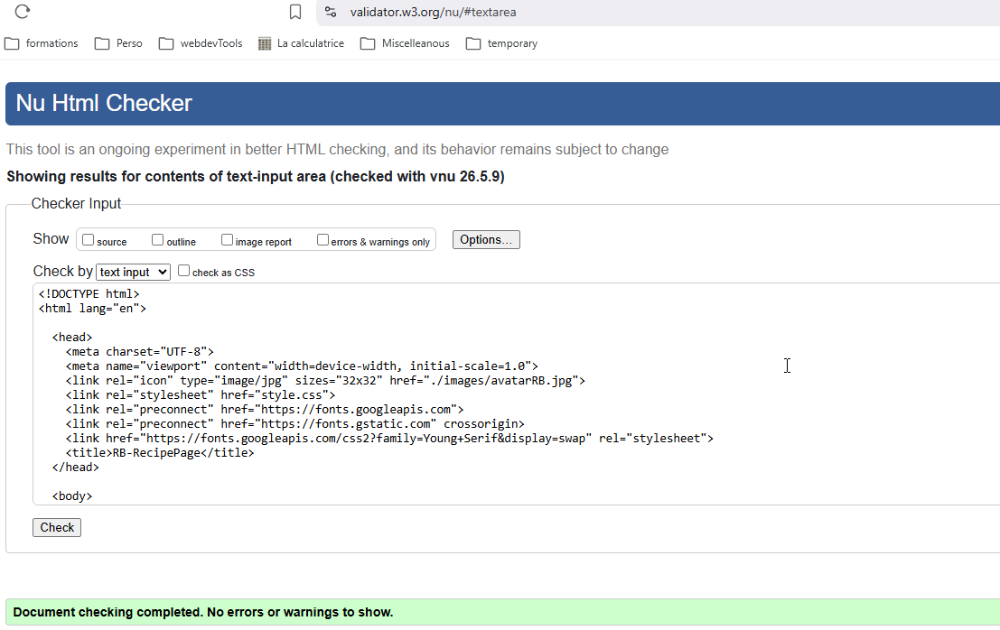
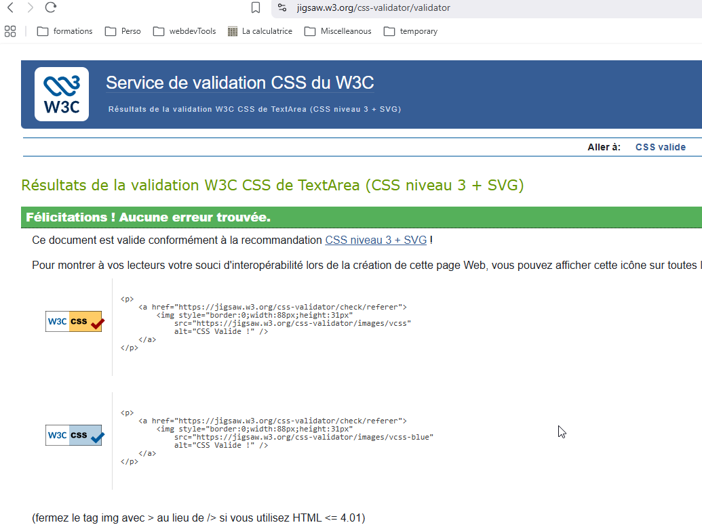

# RB-recipePage

<a href="https://gregarious-cat-a98983.netlify.app/" :target="_blank">Visit my project</a>

This page was using basic CSS and html, you can find both Html and css were validated by W3C:

